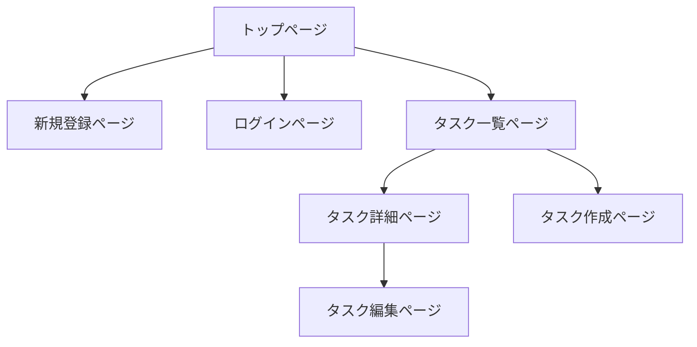

この記事は「[RUNTEQ Advent Calendar 2024](https://qiita.com/advent-calendar/2024/runteq)」23日目の記事になります。

## はじめに

プログラミングスクールRUNTEQでエンジニア兼講師をしているいっぺい（[@ippei_111](https://x.com/ippei_111)）と申します。

いきなりですが個人開発を行う時にアプリケーションのUIを考えるのに悩んだ経験はありませんか？
エンジニアあるあるかもしれませんが、個人開発をする際に機能の実装はできるが、デザインの部分でどうしたら良いのか迷ってしまい、手が止まってしまうことがあると思います。
本来機能開発に時間をかけたいが、デザインに凝りすぎてしまい、余計な工数と時間がかかってしまうことも多々あると思います。

また、デザインに関する知識と経験がないエンジニアがデザインを考えると、「なんかダサいデザイン」「使いずらいUI」になってしまうのもエンジニアあるあるかと思います。

本記事では、デザインに不慣れなエンジニアでも工数を抑えていい感じのデザインを構築する方法について解説していきます。

:::message
本記事は、CSSに対して深い知見がないエンジニアを対象とした内容になっているため、
基本的にコピペで使用できるUIライブラリをもとに画面を構築していきます。
CSSが全く書けない人でもUIを構築できる内容にはなりますが、少しCSSの知識がある方はより理解しやすい内容になっています。
:::

## 工数を抑えていい感じのUIを構築するためのポイント

工数を抑えていい感じのUIにするためのポイントは以下の3点になります。

**1. 自分の感性を信じない**
**2. 他サービスのUIを参考にする**
**3. UIライブラリを使用する**

### 1. 自分の感性を信じない

デザインの勉強をしたことがあるエンジニアには該当しないですが、デザインの勉強をしていないエンジニアが自分の感性を信じてUIを構築したところで、
デザインもプログラミングと同様に専門的な知見が必要です。そのため、勉強せずに取り組むと素人っぽいUIになってしまいがちです。

### 2. 他サービスのUIを参考にする

個人的には自分の感性を信じないで、他サービスのUIを参考にするのが1番良いと思っています。
理由は、基本的に世に出ているサービスのデザイン・UIはデザイナーの方々が考えていることが多いからになります。

デザインのプロが考えているものを参考にすることで、大きく外れるUIを避けることができると思います。

### 3. UIライブラリを使用する

最後に、実際にUIを構築していく際に1番ネックとなるのが **CSS** の実装だと思います。
CSSは難しい技術ではないですが、普段プログラムを書いているエンジニアは意外とCSSに対して苦手意識がある方もいると思います。
そのため、UIライブラリを使用することで、CSSの実装工数を削減することができます。

また、今回はTailwindCSSベースのUIライブラリを複数使用することで、多くのUIのユースケースに対応することができます。

## 概要

実際に簡単なCRUDアプリケーションを開発しながら、UIを整えていく方法を解説していきたいと思います。

:::message alert
本記事では、UI構築の解説がメインとなるため、バックエンドの実装についての解説は省略します。
:::

### 使用技術

以下の技術スタックを想定してデモアプリを開発しながら、解説していきます。
UIライブラリの選定基準は、TailwindCSSベースで使用することができ、ライブラリのinstallが必要ないものを選びました。

- Rails 7.0.0
- TailwindCSS 3.4.17
- [MerakiUI](https://merakiui.com/) - 無料で使えるTailwindCSSベースのUIコンポーネント。
- [Tailwind UI](https://tailwindui.com/components#product-application-ui) - Tailwind公式の有料UIコンポーネント集。

https://merakiui.com/

https://tailwindui.com/components#product-application-ui

:::message alert
本記事では、RailsとTailwindCSSの環境構築についての解説は行いません。
:::

## デモアプリの仕様

今回は簡単なタスク管理アプリをもとに解説をしていきます。

### 画面構成

- トップページ
- 新規登録ページ
- ログインページ
- タスク一覧ページ
- タスク詳細ページ
- タスク作成ページ
- タスク編集ページ

https://github.com/ippei-shimizu/rails_crud_app

