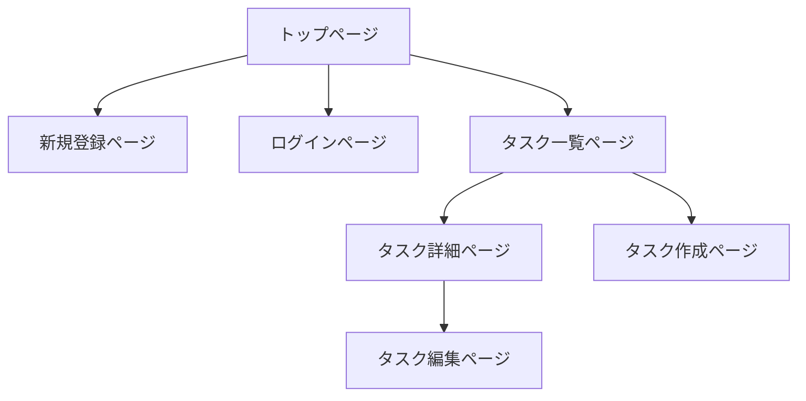

この記事は「[RUNTEQ Advent Calendar 2024](https://qiita.com/advent-calendar/2024/runteq)」23日目の記事になります。

## はじめに

プログラミングスクールRUNTEQでエンジニア兼講師をしているいっぺい（[@ippei_111](https://x.com/ippei_111)）と申します。

いきなりですが個人開発を行う時にアプリケーションのUIを考えるのに悩んだ経験はありませんか？
エンジニアあるあるかもしれませんが、個人開発をする際に機能の実装はできるが、デザインの部分でどうしたら良いのか迷ってしまい、手が止まってしまうことがあると思います。
本来機能開発に時間をかけたいが、デザインに凝りすぎてしまい、余計な工数と時間がかかってしまうことも多々あると思います。

また、デザインに関する知識と経験がないエンジニアがデザインを考えると、「なんかダサいデザイン」「使いずらいUI」になってしまうのもエンジニアあるあるかと思います。

本記事では、デザインに不慣れなエンジニアでも工数を抑えていい感じのデザインを構築する方法について解説していきます。

:::message
本記事は、CSSに対して深い知見がないエンジニアを対象とした内容になっているため、
基本的にコピペで使用できるUIライブラリをもとに画面を構築していきます。
CSSが全く書けない人でもUIを構築できる内容にはなりますが、少しCSSの知識がある方はより理解しやすい内容になっています。
:::

## 工数を抑えていい感じのUIを構築するためのポイント

工数を抑えていい感じのUIにするためのポイントは以下の3点になります。

**1. 自分の感性を信じない**
**2. 他サービスのUIを参考にする**
**3. UIライブラリを使用する**

### 1. 自分の感性を信じない

デザインの勉強をしたことがあるエンジニアには該当しないですが、デザインの勉強をしていないエンジニアが自分の感性を信じてUIを構築したところで、
デザインもプログラミングと同様に専門的な知見が必要です。そのため、勉強せずに取り組むと素人っぽいUIになってしまいがちです。

### 2. 他サービスのUIを参考にする

個人的には自分の感性を信じないで、他サービスのUIを参考にするのが1番良いと思っています。
理由は、基本的に世に出ているサービスのデザイン・UIはデザイナーの方々が考えていることが多いからになります。

デザインのプロが考えているものを参考にすることで、大きく外れるUIを避けることができると思います。

### 3. UIライブラリを使用する

最後に、実際にUIを構築していく際に1番ネックとなるのが **CSS** の実装だと思います。
CSSは難しい技術ではないですが、普段プログラムを書いているエンジニアは意外とCSSに対して苦手意識がある方もいると思います。
そのため、UIライブラリを使用することで、CSSの実装工数を削減することができます。

また、今回はTailwindCSSベースのUIライブラリを複数使用することで、多くのUIのユースケースに対応することができます。

## 概要

実際に簡単なCRUDアプリケーションを開発しながら、UIを整えていく方法を解説していきたいと思います。

:::message alert
本記事では、UI構築の解説がメインとなるため、バックエンドの実装についての解説は省略します。
:::

### 使用技術

以下の技術スタックを想定してデモアプリを開発しながら、解説していきます。
UIライブラリの選定基準は、TailwindCSSベースで使用することができ、ライブラリのinstallが必要ないものを選びました。

- Rails 7.0.0
- TailwindCSS 3.4.17
- [Meraki UI](https://merakiui.com/) - 無料で使えるTailwindCSSベースのUIコンポーネント。
- [Tailwind UI](https://tailwindui.com/components#product-application-ui) - Tailwind公式の有料UIコンポーネント集。

https://merakiui.com/

https://tailwindui.com/components#product-application-ui

:::message alert
本記事では、RailsとTailwindCSSの環境構築についての解説は行いません。
:::

## デモアプリの仕様

今回は簡単なタスク管理アプリをもとに解説をしていきます。

### 画面構成

- トップページ
- 新規登録ページ
- ログインページ
- タスク一覧ページ
- タスク詳細ページ
- タスク作成ページ
- タスク編集ページ



https://github.com/ippei-shimizu/rails_crud_app

:::message alert
ユーザー機能に関しては実装しません。
:::

## 実装

### 🎨 ヘッダー・フッター

まず、ヘッダーから作成していきます。

Meraki UIの[ヘッダーコンポーネント](https://merakiui.com/components/application-ui/navbars)とフッターコンポーネントコピーして、erbに対応する形に変更してアプリケーションに必要な変更を行います。

- ナビゲーションメニューの変更
- 新規登録・ログインボタンの追加
  - [Meraki UI Buttons Components](https://merakiui.com/components/application-ui/buttons)

**◼︎ 現状のUIとコード**

[](https://startup-technology.gyazo.com/1520e1f5bd2c8b678679eb5743fc9ff6)

:::details app/views/layouts/_header.html.erb

```erb:app/views/layouts/_header.html.erb
<nav x-data="{ isOpen: false }" class="relative bg-white shadow dark:bg-gray-800">
  <div class="container px-6 py-4 mx-auto md:flex md:justify-between md:items-center">
    <div class="flex items-center justify-between">
      <%= link_to root_path do %>
      <%= image_tag("https://merakiui.com/images/full-logo.svg", class: "w-auto h-6 sm:h-7", alt: "Logo") %>
      <% end %>

      <div class="flex lg:hidden">
        <button x-cloak @click="isOpen = !isOpen" type="button" class="text-gray-500 dark:text-gray-200 hover:text-gray-600 dark:hover:text-gray-400 focus:outline-none focus:text-gray-600 dark:focus:text-gray-400" aria-label="toggle menu">
          <svg x-show="!isOpen" xmlns="http://www.w3.org/2000/svg" class="w-6 h-6" fill="none" viewBox="0 0 24 24" stroke="currentColor" stroke-width="2">
            <path stroke-linecap="round" stroke-linejoin="round" d="M4 8h16M4 16h16" />
          </svg>

          <svg x-show="isOpen" xmlns="http://www.w3.org/2000/svg" class="w-6 h-6" fill="none" viewBox="0 0 24 24" stroke="currentColor" stroke-width="2">
            <path stroke-linecap="round" stroke-linejoin="round" d="M6 18L18 6M6 6l12 12" />
          </svg>
        </button>
      </div>
    </div>

    <div x-cloak :class="[isOpen ? 'translate-x-0 opacity-100 ' : 'opacity-0 -translate-x-full']" class="absolute inset-x-0 z-20 w-full px-6 py-4 transition-all duration-300 ease-in-out bg-white dark:bg-gray-800 md:mt-0 md:p-0 md:top-0 md:relative md:bg-transparent md:w-auto md:opacity-100 md:translate-x-0 md:flex md:items-center">
      <div class="flex flex-col md:flex-row md:mx-6">
        <%= link_to "トップ", root_path, class: "my-2 text-gray-700 transition-colors duration-300 transform dark:text-gray-200 hover:text-blue-500 dark:hover:text-blue-400 md:mx-4 md:my-0" %>
        <%= link_to "タスク一覧", tasks_path, class: "my-2 text-gray-700 transition-colors duration-300 transform dark:text-gray-200 hover:text-blue-500 dark:hover:text-blue-400 md:mx-4 md:my-0" %>
        <%= link_to "タスク作成", new_task_path, class: "my-2 text-gray-700 transition-colors duration-300 transform dark:text-gray-200 hover:text-blue-500 dark:hover:text-blue-400 md:mx-4 md:my-0" %>
      </div>

      <div class="flex justify-center md:block">
        <button class="px-6 py-2 font-medium tracking-wide text-white capitalize transition-colors duration-300 transform bg-blue-600 rounded-lg hover:bg-blue-500 focus:outline-none focus:ring focus:ring-blue-300 focus:ring-opacity-80">
          新規登録
        </button>
        <button class="px-6 py-2 font-medium tracking-wide text-white capitalize transition-colors duration-300 transform bg-blue-600 rounded-lg hover:bg-blue-500 focus:outline-none focus:ring focus:ring-blue-300 focus:ring-opacity-80">
          ログイン
        </button>
      </div>
    </div>
  </div>
</nav>
```

:::

:::details app/views/layouts/_footer.html.erb

```erb:app/views/layouts/_footer.html.erb
<footer class="bg-white dark:bg-gray-900">
  <div class="container px-6 py-8 mx-auto">
    <div class="flex flex-col items-center text-center">
      <%= link_to root_path do %>
      <%= image_tag("https://merakiui.com/images/full-logo.svg", class: "w-auto h-7", alt: "Logo") %>
      <% end %>

      <div class="flex flex-wrap justify-center mt-6 -mx-4">
        <%= link_to "トップ", root_path, class: "mx-4 text-sm text-gray-600 transition-colors duration-300 hover:text-blue-500 dark:text-gray-300 dark:hover:text-blue-400", aria: { label: "top" } %>
        <%= link_to "お問い合わせ", root_path, class: "mx-4 text-sm text-gray-600 transition-colors duration-300 hover:text-blue-500 dark:text-gray-300 dark:hover:text-blue-400", aria: { label: "contact" } %>
        <%= link_to "プライバシーポリシー", root_path, class: "mx-4 text-sm text-gray-600 transition-colors duration-300 hover:text-blue-500 dark:text-gray-300 dark:hover:text-blue-400", aria: { label: "privacy" } %>
      </div>
    </div>

    <hr class="my-6 border-gray-200 md:my-10 dark:border-gray-700" />

    <div class="flex flex-col items-center sm:flex-row sm:justify-between">
      <p class="text-sm text-gray-500 dark:text-gray-300">© Copyright 2021. All Rights Reserved.</p>

      <div class="flex -mx-2">
        <%= link_to "#", class: "mx-2 text-gray-600 transition-colors duration-300 dark:text-gray-300 hover:text-blue-500 dark:hover:text-blue-400", aria: { label: "Reddit" } do %>
        <svg class="w-5 h-5 fill-current" viewBox="0 0 24 24" fill="none" xmlns="http://www.w3.org/2000/svg">
          <path d="M12 22C6.47715 22 2 17.5228 2 12C2 6.47715 6.47715 2 12 2C17.5228 2 22 6.47715 22 12C21.9939 17.5203 17.5203 21.9939 12 22ZM6.807 10.543C6.20862 10.5433 5.67102 10.9088 5.45054 11.465C5.23006 12.0213 5.37133 12.6558 5.807 13.066C5.92217 13.1751 6.05463 13.2643 6.199 13.33C6.18644 13.4761 6.18644 13.6229 6.199 13.769C6.199 16.009 8.814 17.831 12.028 17.831C15.242 17.831 17.858 16.009 17.858 13.769C17.8696 13.6229 17.8696 13.4761 17.858 13.33C18.4649 13.0351 18.786 12.3585 18.6305 11.7019C18.475 11.0453 17.8847 10.5844 17.21 10.593H17.157C16.7988 10.6062 16.458 10.7512 16.2 11C15.0625 10.2265 13.7252 9.79927 12.35 9.77L13 6.65L15.138 7.1C15.1931 7.60706 15.621 7.99141 16.131 7.992C16.1674 7.99196 16.2038 7.98995 16.24 7.986C16.7702 7.93278 17.1655 7.47314 17.1389 6.94094C17.1122 6.40873 16.6729 5.991 16.14 5.991C16.1022 5.99191 16.0645 5.99491 16.027 6C15.71 6.03367 15.4281 6.21641 15.268 6.492L12.82 6C12.7983 5.99535 12.7762 5.993 12.754 5.993C12.6094 5.99472 12.4851 6.09583 12.454 6.237L11.706 9.71C10.3138 9.7297 8.95795 10.157 7.806 10.939C7.53601 10.6839 7.17843 10.5422 6.807 10.543ZM12.18 16.524C12.124 16.524 12.067 16.524 12.011 16.524C11.955 16.524 11.898 16.524 11.842 16.524C11.0121 16.5208 10.2054 16.2497 9.542 15.751C9.49626 15.6958 9.47445 15.6246 9.4814 15.5533C9.48834 15.482 9.52348 15.4163 9.579 15.371C9.62737 15.3318 9.68771 15.3102 9.75 15.31C9.81233 15.31 9.87275 15.3315 9.921 15.371C10.4816 15.7818 11.159 16.0022 11.854 16C11.9027 16 11.9513 16 12 16C12.059 16 12.119 16 12.178 16C12.864 16.0011 13.5329 15.7863 14.09 15.386C14.1427 15.3322 14.2147 15.302 14.29 15.302C14.3653 15.302 14.4373 15.3322 14.49 15.386C14.5985 15.4981 14.5962 15.6767 14.485 15.786V15.746C13.8213 16.2481 13.0123 16.5208 12.18 16.523V16.524ZM14.307 14.08H14.291L14.299 14.041C13.8591 14.011 13.4994 13.6789 13.4343 13.2429C13.3691 12.8068 13.6162 12.3842 14.028 12.2269C14.4399 12.0697 14.9058 12.2202 15.1478 12.5887C15.3899 12.9572 15.3429 13.4445 15.035 13.76C14.856 13.9554 14.6059 14.0707 14.341 14.08H14.306H14.307Z" stroke="currentColor" stroke-width="2" stroke-linecap="round" stroke-linejoin="round" />
        </svg>
        <% end %>
      </div>
    </div>
  </div>
</footer>
```

:::
