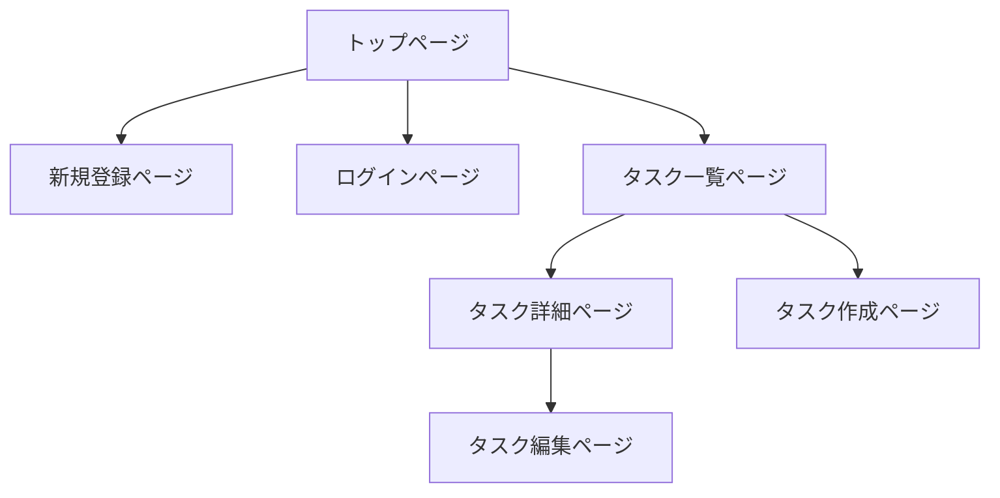

この記事は「[RUNTEQ Advent Calendar 2024](https://qiita.com/advent-calendar/2024/runteq)」23日目の記事になります。

## はじめに

プログラミングスクールRUNTEQでエンジニア兼講師をしているいっぺい（[@ippei_111](https://x.com/ippei_111)）と申します。

いきなりですが個人開発を行う時にアプリケーションのUIを考えるのに悩んだ経験はありませんか？
エンジニアあるあるかもしれませんが、個人開発をする際に機能の実装はできるが、デザインの部分でどうしたら良いのか迷ってしまい、手が止まってしまうことがあると思います。
本来機能開発に時間をかけたいが、デザインに凝りすぎてしまい、余計な工数と時間がかかってしまうことも多々あると思います。

また、デザインに関する知識と経験がないエンジニアがデザインを考えると、「なんかダサいデザイン」「使いずらいUI」になってしまうのもエンジニアあるあるかと思います。

本記事では、デザインに不慣れなエンジニアでも工数を抑えていい感じのデザインを構築する方法について解説していきます。

:::message
本記事は、CSSに対して深い知見がないエンジニアを対象とした内容になっているため、
基本的にコピペで使用できるUIライブラリをもとに画面を構築していきます。
CSSが全く書けない人でもUIを構築できる内容にはなりますが、少しCSSの知識がある方はより理解しやすい内容になっています。
:::

## 工数を抑えていい感じのUIを構築するためのポイント

工数を抑えていい感じのUIにするためのポイントは以下の3点になります。

**1. 自分の感性を信じない**
**2. 他サービスのUIを参考にする**
**3. UIライブラリを使用する**

### 1. 自分の感性を信じない

デザインの勉強をしたことがあるエンジニアには該当しないですが、デザインの勉強をしていないエンジニアが自分の感性を信じてUIを構築したところで、
デザインもプログラミングと同様に専門的な知見が必要です。そのため、勉強せずに取り組むと素人っぽいUIになってしまいがちです。

### 2. 他サービスのUIを参考にする

個人的には自分の感性を信じないで、他サービスのUIを参考にするのが1番良いと思っています。
理由は、基本的に世に出ているサービスのデザイン・UIはデザイナーの方々が考えていることが多いからになります。

デザインのプロが考えているものを参考にすることで、大きく外れるUIを避けることができると思います。

CSSの知識が必要にはなるのですが、ブラウザのdeveloperツールを使用してfont-sizeやmargin, paddingなどの数値を見てどのくらいにしているのかを参考にしたりするもの良いと思います。

[](https://startup-technology.gyazo.com/99db554cd0e31a9d604ec2e016c7f0f4)

### 3. UIライブラリを使用する

最後に、実際にUIを構築していく際に1番ネックとなるのが **CSS** の実装だと思います。
CSSは難しい技術ではないですが、普段プログラムを書いているエンジニアは意外とCSSに対して苦手意識がある方もいると思います。
そのため、UIライブラリを使用することで、CSSの実装工数を削減することができます。

また、今回はTailwindCSSベースのUIライブラリを複数使用することで、多くのUIのユースケースに対応することができます。

今回は、Meraki UI という Tailwind CSS ベースのUIライブラリを使用して実装していきます。

https://merakiui.com/

https://github.com/merakiuilabs

## 概要

実際に簡単なCRUDアプリケーションを開発しながら、UIを整えていく方法を解説していきたいと思います。

:::message alert
本記事では、UI構築の解説がメインとなるため、バックエンドの実装についての解説は省略します。
:::

### 使用技術

以下の技術スタックを想定してデモアプリを開発しながら、解説していきます。
UIライブラリの選定基準は、TailwindCSSベースで使用することができ、ライブラリのinstallが必要ないものを選びました。

- Rails 7.0.0
- TailwindCSS 3.4.17
- [Meraki UI](https://merakiui.com/) - 無料で使えるTailwindCSSベースのUIコンポーネント。

https://merakiui.com/

https://tailwindui.com/components#product-application-ui

:::message alert
本記事では、RailsとTailwindCSSの環境構築についての解説は行いません。
:::

## デモアプリの仕様

今回は簡単なタスク管理アプリをもとに解説をしていきます。

### 画面構成

- トップページ
- 新規登録ページ
- ログインページ
- タスク一覧ページ
- タスク詳細ページ
- タスク作成ページ
- タスク編集ページ



https://github.com/ippei-shimizu/rails_crud_app

:::message alert
ユーザー機能に関しては実装しません。
:::

## 実装

### 🎨 ヘッダー・フッター

まず、ヘッダーから作成していきます。

Meraki UIの[ヘッダーコンポーネント](https://merakiui.com/components/application-ui/navbars)とフッターコンポーネントコピーして、erbに対応する形に変更してアプリケーションに必要な変更を行います。

- ナビゲーションメニューの変更
- 新規登録・ログインボタンの追加
  - [Meraki UI Buttons Components](https://merakiui.com/components/application-ui/buttons)

**◼︎ 現状のUIとコード**

[](https://startup-technology.gyazo.com/1520e1f5bd2c8b678679eb5743fc9ff6)

:::details app/views/layouts/_header.html.erb

```erb:app/views/layouts/_header.html.erb
<nav x-data="{ isOpen: false }" class="relative bg-white shadow dark:bg-gray-800">
  <div class="container px-6 py-4 mx-auto md:flex md:justify-between md:items-center">
    <div class="flex items-center justify-between">
      <%= link_to root_path do %>
      <%= image_tag("https://merakiui.com/images/full-logo.svg", class: "w-auto h-6 sm:h-7", alt: "Logo") %>
      <% end %>

      <div class="flex lg:hidden">
        <button x-cloak @click="isOpen = !isOpen" type="button" class="text-gray-500 dark:text-gray-200 hover:text-gray-600 dark:hover:text-gray-400 focus:outline-none focus:text-gray-600 dark:focus:text-gray-400" aria-label="toggle menu">
          <svg x-show="!isOpen" xmlns="http://www.w3.org/2000/svg" class="w-6 h-6" fill="none" viewBox="0 0 24 24" stroke="currentColor" stroke-width="2">
            <path stroke-linecap="round" stroke-linejoin="round" d="M4 8h16M4 16h16" />
          </svg>

          <svg x-show="isOpen" xmlns="http://www.w3.org/2000/svg" class="w-6 h-6" fill="none" viewBox="0 0 24 24" stroke="currentColor" stroke-width="2">
            <path stroke-linecap="round" stroke-linejoin="round" d="M6 18L18 6M6 6l12 12" />
          </svg>
        </button>
      </div>
    </div>

    <div x-cloak :class="[isOpen ? 'translate-x-0 opacity-100 ' : 'opacity-0 -translate-x-full']" class="absolute inset-x-0 z-20 w-full px-6 py-4 transition-all duration-300 ease-in-out bg-white dark:bg-gray-800 md:mt-0 md:p-0 md:top-0 md:relative md:bg-transparent md:w-auto md:opacity-100 md:translate-x-0 md:flex md:items-center">
      <div class="flex flex-col md:flex-row md:mx-6">
        <%= link_to "トップ", root_path, class: "my-2 text-gray-700 transition-colors duration-300 transform dark:text-gray-200 hover:text-blue-500 dark:hover:text-blue-400 md:mx-4 md:my-0" %>
        <%= link_to "タスク一覧", tasks_path, class: "my-2 text-gray-700 transition-colors duration-300 transform dark:text-gray-200 hover:text-blue-500 dark:hover:text-blue-400 md:mx-4 md:my-0" %>
        <%= link_to "タスク作成", new_task_path, class: "my-2 text-gray-700 transition-colors duration-300 transform dark:text-gray-200 hover:text-blue-500 dark:hover:text-blue-400 md:mx-4 md:my-0" %>
      </div>

      <div class="flex justify-center md:block">
        <button class="px-6 py-2 font-medium tracking-wide text-white capitalize transition-colors duration-300 transform bg-blue-600 rounded-lg hover:bg-blue-500 focus:outline-none focus:ring focus:ring-blue-300 focus:ring-opacity-80">
          新規登録
        </button>
        <button class="px-6 py-2 font-medium tracking-wide text-white capitalize transition-colors duration-300 transform bg-blue-600 rounded-lg hover:bg-blue-500 focus:outline-none focus:ring focus:ring-blue-300 focus:ring-opacity-80">
          ログイン
        </button>
      </div>
    </div>
  </div>
</nav>
```

:::

:::details app/views/layouts/_footer.html.erb

```erb:app/views/layouts/_footer.html.erb
<footer class="bg-white dark:bg-gray-900">
  <div class="container px-6 py-8 mx-auto">
    <div class="flex flex-col items-center text-center">
      <%= link_to root_path do %>
      <%= image_tag("https://merakiui.com/images/full-logo.svg", class: "w-auto h-7", alt: "Logo") %>
      <% end %>

      <div class="flex flex-wrap justify-center mt-6 -mx-4">
        <%= link_to "トップ", root_path, class: "mx-4 text-sm text-gray-600 transition-colors duration-300 hover:text-blue-500 dark:text-gray-300 dark:hover:text-blue-400", aria: { label: "top" } %>
        <%= link_to "お問い合わせ", root_path, class: "mx-4 text-sm text-gray-600 transition-colors duration-300 hover:text-blue-500 dark:text-gray-300 dark:hover:text-blue-400", aria: { label: "contact" } %>
        <%= link_to "プライバシーポリシー", root_path, class: "mx-4 text-sm text-gray-600 transition-colors duration-300 hover:text-blue-500 dark:text-gray-300 dark:hover:text-blue-400", aria: { label: "privacy" } %>
      </div>
    </div>

    <hr class="my-6 border-gray-200 md:my-10 dark:border-gray-700" />

    <div class="flex flex-col items-center sm:flex-row sm:justify-between">
      <p class="text-sm text-gray-500 dark:text-gray-300">© Copyright 2021. All Rights Reserved.</p>

      <div class="flex -mx-2">
        <%= link_to "#", class: "mx-2 text-gray-600 transition-colors duration-300 dark:text-gray-300 hover:text-blue-500 dark:hover:text-blue-400", aria: { label: "Reddit" } do %>
        <svg class="w-5 h-5 fill-current" viewBox="0 0 24 24" fill="none" xmlns="http://www.w3.org/2000/svg">
          <path d="M12 22C6.47715 22 2 17.5228 2 12C2 6.47715 6.47715 2 12 2C17.5228 2 22 6.47715 22 12C21.9939 17.5203 17.5203 21.9939 12 22ZM6.807 10.543C6.20862 10.5433 5.67102 10.9088 5.45054 11.465C5.23006 12.0213 5.37133 12.6558 5.807 13.066C5.92217 13.1751 6.05463 13.2643 6.199 13.33C6.18644 13.4761 6.18644 13.6229 6.199 13.769C6.199 16.009 8.814 17.831 12.028 17.831C15.242 17.831 17.858 16.009 17.858 13.769C17.8696 13.6229 17.8696 13.4761 17.858 13.33C18.4649 13.0351 18.786 12.3585 18.6305 11.7019C18.475 11.0453 17.8847 10.5844 17.21 10.593H17.157C16.7988 10.6062 16.458 10.7512 16.2 11C15.0625 10.2265 13.7252 9.79927 12.35 9.77L13 6.65L15.138 7.1C15.1931 7.60706 15.621 7.99141 16.131 7.992C16.1674 7.99196 16.2038 7.98995 16.24 7.986C16.7702 7.93278 17.1655 7.47314 17.1389 6.94094C17.1122 6.40873 16.6729 5.991 16.14 5.991C16.1022 5.99191 16.0645 5.99491 16.027 6C15.71 6.03367 15.4281 6.21641 15.268 6.492L12.82 6C12.7983 5.99535 12.7762 5.993 12.754 5.993C12.6094 5.99472 12.4851 6.09583 12.454 6.237L11.706 9.71C10.3138 9.7297 8.95795 10.157 7.806 10.939C7.53601 10.6839 7.17843 10.5422 6.807 10.543ZM12.18 16.524C12.124 16.524 12.067 16.524 12.011 16.524C11.955 16.524 11.898 16.524 11.842 16.524C11.0121 16.5208 10.2054 16.2497 9.542 15.751C9.49626 15.6958 9.47445 15.6246 9.4814 15.5533C9.48834 15.482 9.52348 15.4163 9.579 15.371C9.62737 15.3318 9.68771 15.3102 9.75 15.31C9.81233 15.31 9.87275 15.3315 9.921 15.371C10.4816 15.7818 11.159 16.0022 11.854 16C11.9027 16 11.9513 16 12 16C12.059 16 12.119 16 12.178 16C12.864 16.0011 13.5329 15.7863 14.09 15.386C14.1427 15.3322 14.2147 15.302 14.29 15.302C14.3653 15.302 14.4373 15.3322 14.49 15.386C14.5985 15.4981 14.5962 15.6767 14.485 15.786V15.746C13.8213 16.2481 13.0123 16.5208 12.18 16.523V16.524ZM14.307 14.08H14.291L14.299 14.041C13.8591 14.011 13.4994 13.6789 13.4343 13.2429C13.3691 12.8068 13.6162 12.3842 14.028 12.2269C14.4399 12.0697 14.9058 12.2202 15.1478 12.5887C15.3899 12.9572 15.3429 13.4445 15.035 13.76C14.856 13.9554 14.6059 14.0707 14.341 14.08H14.306H14.307Z" stroke="currentColor" stroke-width="2" stroke-linecap="round" stroke-linejoin="round" />
        </svg>
        <% end %>
      </div>
    </div>
  </div>
</footer>
```

:::


### 🎨 トップページ

次にトップページのUIを実装していきます。
トップページのコンテンツとしては以下のものを想定します。

- ファーストビュー
  - [Meraki UI Heros Coomponents](https://merakiui.com/components/marketing/heros) の一部を使用。
- 使い方説明

**◼︎ ファーストビューのUIとコード**

基本的には、[Meraki UI Heros Coomponents](https://merakiui.com/components/marketing/heros) からコピーしたものを使用して、一部微調整を行なっています。

- 一部ボタンを変更
- 文言変更

[](https://startup-technology.gyazo.com/72ef806d49ce3fcb7e4f9ee6c736a58c)

:::details app/views/home/index.html.erb

```erb:app/views/home/index.html.erb
<div>
  <div class="container px-6 py-16 mx-auto">
    <div class="items-center lg:flex">
      <div class="w-full lg:w-1/2">
        <div class="lg:max-w-lg">
          <h1 class="text-3xl font-semibold text-gray-800 dark:text-white lg:text-4xl">タスク管理アプリ<br><span class="text-blue-500 ">デモアプリ</span></h1>

          <p class="mt-3 text-gray-600 dark:text-gray-400">この文章はダミーです。文字の大きさ、量、字間、行間等を確認するために入れています。この文章はダミーです。文字の大きさ、量、字間、行間等を確認するために入れています。この文章はダミーです。文字の大きさ、</p>

          <%= link_to "タスク作成する", new_task_path, class: "block w-fit px-5 py-2 mt-6 text-sm tracking-wider text-white uppercase transition-colors duration-300 transform bg-blue-600 rounded-lg hover:bg-blue-500 focus:outline-none focus:bg-blue-500" %>
        </div>
      </div>

      <div class="flex items-center justify-center w-full mt-6 lg:mt-0 lg:w-1/2">
        
      </div>
    </div>
  </div>
</div>
```

:::

**◼︎ 使い方説明のUIとコード**

このセクションも同様に [Meraki UI Features Components](https://merakiui.com/components/marketing/features) を使用します。
ここにはアプリケーションの特徴を記載します。

（ここらへんから、erbへの変換が雑になってきますがご了承ください🙇‍♂️）

**[本アプリの特徴]**

[](https://startup-technology.gyazo.com/ab1d8f2baa048d4d4758b741c1b0bd9e)

:::details app/views/home/index.html.erb

```erb:app/views/home/index.html.erb
<div>
  <!--- ファーストビュー --->

  <!--- 特徴 --->
  <section class="bg-white dark:bg-gray-900">
    <div class="container px-6 py-10 mx-auto">
      <h1 class="text-2xl font-semibold text-gray-800 capitalize lg:text-3xl dark:text-white">アプリの特徴を記載する <br><span class="underline decoration-blue-500">ユーザーがどんなアプリなのかわかるように</span></h1>

      <p class="mt-4 text-gray-500 xl:mt-6 dark:text-gray-300">
        この文章はダミーです。文字の大きさ、量、字間、行間等を確認するために入れています。この文章はダミーで
      </p>

      <div class="grid grid-cols-1 gap-8 mt-8 xl:mt-12 xl:gap-12 md:grid-cols-2 xl:grid-cols-3">
        <div class="p-8 space-y-3 border-2 border-blue-400 dark:border-blue-300 rounded-xl">
          <span class="inline-block text-blue-500 dark:text-blue-400">
            <svg xmlns="http://www.w3.org/2000/svg" class="w-8 h-8" fill="none" viewBox="0 0 24 24" stroke="currentColor">
              <path stroke-linecap="round" stroke-linejoin="round" stroke-width="2" d="M17.657 18.657A8 8 0 016.343 7.343S7 9 9 10c0-2 .5-5 2.986-7C14 5 16.09 5.777 17.656 7.343A7.975 7.975 0 0120 13a7.975 7.975 0 01-2.343 5.657z" />
              <path stroke-linecap="round" stroke-linejoin="round" stroke-width="2" d="M9.879 16.121A3 3 0 1012.015 11L11 14H9c0 .768.293 1.536.879 2.121z" />
            </svg>
          </span>

          <h1 class="text-xl font-semibold text-gray-700 capitalize dark:text-white">おすすめポイント1</h1>

          <p class="text-gray-500 dark:text-gray-300">
            この文章はダミーです。文字の大きさ、量、字間、行間等を確認するために入れています。この文章はダミーです。文字の大きさ、量、字間、行間等を確認するために入れていま
          </p>

          <a href="#" class="inline-flex p-2 text-blue-500 capitalize transition-colors duration-300 transform bg-blue-100 rounded-full rtl:-scale-x-100 dark:bg-blue-500 dark:text-white hover:underline hover:text-blue-600 dark:hover:text-blue-500">
            <svg xmlns="http://www.w3.org/2000/svg" class="w-6 h-6" fill="none" viewBox="0 0 24 24" stroke="currentColor">
              <path stroke-linecap="round" stroke-linejoin="round" stroke-width="2" d="M13 9l3 3m0 0l-3 3m3-3H8m13 0a9 9 0 11-18 0 9 9 0 0118 0z" />
            </svg>
          </a>
        </div>

        <div class="p-8 space-y-3 border-2 border-blue-400 dark:border-blue-300 rounded-xl">
          <span class="inline-block text-blue-500 dark:text-blue-400">
            <svg xmlns="http://www.w3.org/2000/svg" class="w-8 h-8" fill="none" viewBox="0 0 24 24" stroke="currentColor">
              <path stroke-linecap="round" stroke-linejoin="round" stroke-width="2" d="M11 4a2 2 0 114 0v1a1 1 0 001 1h3a1 1 0 011 1v3a1 1 0 01-1 1h-1a2 2 0 100 4h1a1 1 0 011 1v3a1 1 0 01-1 1h-3a1 1 0 01-1-1v-1a2 2 0 10-4 0v1a1 1 0 01-1 1H7a1 1 0 01-1-1v-3a1 1 0 00-1-1H4a2 2 0 110-4h1a1 1 0 001-1V7a1 1 0 011-1h3a1 1 0 001-1V4z" />
            </svg>
          </span>

          <h1 class="text-xl font-semibold text-gray-700 capitalize dark:text-white">おすすめポイント2</h1>

          <p class="text-gray-500 dark:text-gray-300">
            この文章はダミーです。文字の大きさ、量、字間、行間等を確認するために入れています。この文章はダミーです。文字の大きさ、量、字間、行間等を確認するために入れていま
          </p>

          <a href="#" class="inline-flex p-2 text-blue-500 capitalize transition-colors duration-300 transform bg-blue-100 rounded-full rtl:-scale-x-100 dark:bg-blue-500 dark:text-white hover:underline hover:text-blue-600 dark:hover:text-blue-500">
            <svg xmlns="http://www.w3.org/2000/svg" class="w-6 h-6" fill="none" viewBox="0 0 24 24" stroke="currentColor">
              <path stroke-linecap="round" stroke-linejoin="round" stroke-width="2" d="M13 9l3 3m0 0l-3 3m3-3H8m13 0a9 9 0 11-18 0 9 9 0 0118 0z" />
            </svg>
          </a>
        </div>

        <div class="p-8 space-y-3 border-2 border-blue-400 dark:border-blue-300 rounded-xl">
          <span class="inline-block text-blue-500 dark:text-blue-400">
            <svg xmlns="http://www.w3.org/2000/svg" class="w-8 h-8" fill="none" viewBox="0 0 24 24" stroke="currentColor">
              <path stroke-linecap="round" stroke-linejoin="round" stroke-width="2" d="M5 3v4M3 5h4M6 17v4m-2-2h4m5-16l2.286 6.857L21 12l-5.714 2.143L13 21l-2.286-6.857L5 12l5.714-2.143L13 3z" />
            </svg>
          </span>

          <h1 class="text-xl font-semibold text-gray-700 capitalize dark:text-white">おすすめポイント3</h1>

          <p class="text-gray-500 dark:text-gray-300">
            この文章はダミーです。文字の大きさ、量、字間、行間等を確認するために入れています。この文章はダミーです。文字の大きさ、量、字間、行間等を確認するために入れていま
          </p>

          <a href="#" class="inline-flex p-2 text-blue-500 capitalize transition-colors duration-300 transform bg-blue-100 rounded-full rtl:-scale-x-100 dark:bg-blue-500 dark:text-white hover:underline hover:text-blue-600 dark:hover:text-blue-500">
            <svg xmlns="http://www.w3.org/2000/svg" class="w-6 h-6" fill="none" viewBox="0 0 24 24" stroke="currentColor">
              <path stroke-linecap="round" stroke-linejoin="round" stroke-width="2" d="M13 9l3 3m0 0l-3 3m3-3H8m13 0a9 9 0 11-18 0 9 9 0 0118 0z" />
            </svg>
          </a>
        </div>
      </div>
    </div>
  </section>
</div>
```

:::


**[詳細な使い方説明]**

次に、より詳細な使い方説明を記載します。
実際にアプリを使用しているgif画像などを記載するとより視覚的に使い方を伝えることができます。

このセクションは、こちらの[コンポーネント](https://merakiui.com/components/marketing/portfolio)を使用してみます。

説明文などは必要であれば追加します。

[](https://startup-technology.gyazo.com/fb36cade7995d2e021f7bea3f87e4b66)

:::details app/views/home/index.html.erb

```erb:app/views/home/index.html.erb
  <!--- 詳細は使い方説明 --->
  <section class="bg-white dark:bg-gray-900">
    <div class="container px-6 py-10 mx-auto">
      <h1 class="text-2xl font-semibold text-center text-gray-800 capitalize lg:text-3xl dark:text-white">使い方
      </h1>

      <p class="mt-4 text-center text-gray-500 dark:text-gray-300">
        この文章はダミーです。文字の大きさ、量、字間、行間等を確認するために入れています。この文章はダミーで
      </p>


      <div class="grid grid-cols-1 gap-8 mt-8 xl:mt-12 xl:gap-12 md:grid-cols-2 xl:grid-cols-3">
        <div>
          
          <h2 class="mt-4 text-xl font-semibold text-gray-800 capitalize dark:text-white">使い方説明1
            collections</h2>
          <p class="mt-2 text-lg tracking-wider text-blue-500 uppercase dark:text-blue-400 ">この文章はダミーです。文字の大きさ、量、字間、行間等を確認するために入れています。この文章はダミーです。文字の大きさ、量、字間、行間等を確認するために入れています。この文章はダミーです。文字の大きさ、</p>
        </div>

        <div>
          
          <h2 class="mt-4 text-xl font-semibold text-gray-800 capitalize dark:text-white">使い方説明2
            collections</h2>
          <p class="mt-2 text-lg tracking-wider text-blue-500 uppercase dark:text-blue-400 ">この文章はダミーです。文字の大きさ、量、字間、行間等を確認するために入れています。この文章はダミーです。文字の大きさ、量、字間、行間等を確認するために入れています。この文章はダミーです。文字の大きさ、</p>
        </div>

        <div>
          
          <h2 class="mt-4 text-xl font-semibold text-gray-800 capitalize dark:text-white">使い方説明3
          </h2>
          <p class="mt-2 text-lg tracking-wider text-blue-500 uppercase dark:text-blue-400 ">この文章はダミーです。文字の大きさ、量、字間、行間等を確認するために入れています。この文章はダミーです。文字の大きさ、量、字間、行間等を確認するために入れています。この文章はダミーです。文字の大きさ、</p>
        </div>
      </div>
    </div>
  </section>
```

:::


ほぼ、Meraki UI のコンポーネントをコピペしただけでいい感じのトップページが完成しました。
追加でFAQやコンバージョンセクションも追加してあげるとUXの向上が図れると思います。

https://merakiui.com/components/marketing/faq

https://merakiui.com/components/marketing/cta


### 🎨 新規登録・ログインページ

次に、新規登録・ログインページのUIを構築します。
こちらはフォームがメインになると思うので、こちらの[コンポーネント](https://merakiui.com/components/application-ui/forms)を使用します。

どちらのページもほぼ同じUIになるので、新規登録ページのみ記載します。

**◼︎ 新規登録ページ**

こちらもコピペするだけで簡単にUIを構築することができました。

[](https://startup-technology.gyazo.com/d8f40022f3665a0d115916d7114a4a95)

:::details コード

```
<div>
  <div class="flex items-center justify-center flex-col min-h-screen">
    <section class="max-w-4xl p-6 mx-auto bg-white rounded-md shadow-md dark:bg-gray-800">
      <h2 class="text-lg font-semibold text-gray-700 capitalize dark:text-white">新規登録</h2>

      <form>
        <div class="grid grid-cols-1 gap-6 mt-4 sm:grid-cols-2">
          <div>
            <label class="text-gray-700 dark:text-gray-200" for="username">Username</label>
            <input id="username" type="text" class="block w-full px-4 py-2 mt-2 text-gray-700 bg-white border border-gray-200 rounded-md dark:bg-gray-800 dark:text-gray-300 dark:border-gray-600 focus:border-blue-400 focus:ring-blue-300 focus:ring-opacity-40 dark:focus:border-blue-300 focus:outline-none focus:ring">
          </div>

          <div>
            <label class="text-gray-700 dark:text-gray-200" for="emailAddress">Email Address</label>
            <input id="emailAddress" type="email" class="block w-full px-4 py-2 mt-2 text-gray-700 bg-white border border-gray-200 rounded-md dark:bg-gray-800 dark:text-gray-300 dark:border-gray-600 focus:border-blue-400 focus:ring-blue-300 focus:ring-opacity-40 dark:focus:border-blue-300 focus:outline-none focus:ring">
          </div>

          <div>
            <label class="text-gray-700 dark:text-gray-200" for="password">Password</label>
            <input id="password" type="password" class="block w-full px-4 py-2 mt-2 text-gray-700 bg-white border border-gray-200 rounded-md dark:bg-gray-800 dark:text-gray-300 dark:border-gray-600 focus:border-blue-400 focus:ring-blue-300 focus:ring-opacity-40 dark:focus:border-blue-300 focus:outline-none focus:ring">
          </div>

          <div>
            <label class="text-gray-700 dark:text-gray-200" for="passwordConfirmation">Password Confirmation</label>
            <input id="passwordConfirmation" type="password" class="block w-full px-4 py-2 mt-2 text-gray-700 bg-white border border-gray-200 rounded-md dark:bg-gray-800 dark:text-gray-300 dark:border-gray-600 focus:border-blue-400 focus:ring-blue-300 focus:ring-opacity-40 dark:focus:border-blue-300 focus:outline-none focus:ring">
          </div>
        </div>

        <div class="flex justify-end mt-6">
          <button class="px-8 py-2.5 leading-5 text-white transition-colors duration-300 transform bg-gray-700 rounded-md hover:bg-gray-600 focus:outline-none focus:bg-gray-600">Save</button>
        </div>
      </form>
    </section>
  </div>
</div>
```

:::


### 🎨 タスク一覧ページ

次にタスク一覧ページのUIの実装していきます。

スタイルが適用されていない状態は以下になります。すごく見ずらくて使いずらいUIになっています。
ここから、UIコンポーネントを適用していい感じのUIにしていきます。

[](https://startup-technology.gyazo.com/2a8ef87c65692503891562df91ac651f)

タスク一覧ページですので、テーブルUIを使用するといい感じに実装できそうです。
必要のない要素は削除して、整えていきます。

https://merakiui.com/components/application-ui/tables

少し、手を加えましたが、ほぼ Meraki UI Tables をコピペしたまま使用することができました。

[](https://startup-technology.gyazo.com/a38af04f89c697e01a1a054c61063d7a)

:::details app/views/tasks/index.html.erb

```erb:app/views/tasks/index.html.erb
<div>
  <section class="container px-4 mx-auto pt-10 pb-[120px]">
    <div class="flex items-center justify-between">
      <div>
        <h2 class="text-2xl font-bold text-gray-800 dark:text-white">タスク一覧</h2>
        <p class="mt-1 text-sm text-gray-500 dark:text-gray-300">この文章はダミーです。文字の大きさ、量、字間、行間等を確認するために入れています。この文章</p>
      </div>
      <%= link_to "タスク作成", new_task_path, class: "px-6 py-2 font-medium tracking-wide text-white capitalize transition-colors duration-300 transform bg-blue-600 rounded-lg hover:bg-blue-300 focus:outline-none focus:ring focus:ring-blue-300 focus:ring-opacity-80" %>
    </div>

    <div class="flex flex-col mt-6">
      <div class="-mx-4 -my-2 overflow-x-auto sm:-mx-6 lg:-mx-8">
        <div class="inline-block min-w-full py-2 align-middle md:px-6 lg:px-8">
          <div class="overflow-hidden border border-gray-200 dark:border-gray-700 md:rounded-lg">

            <table class="min-w-full divide-y divide-gray-200 dark:divide-gray-700">
              <thead class="bg-gray-50 dark:bg-gray-800">
                <tr>
                  <th scope="col" class="py-3.5 px-4 text-sm font-normal text-left rtl:text-right text-gray-500 dark:text-gray-400 w-[300px] whitespace-nowrap">
                    <button class="flex items-center gap-x-3 focus:outline-none">
                      <span>タイトル</span>

                      <svg class="h-3" viewBox="0 0 10 11" fill="none" xmlns="http://www.w3.org/2000/svg">
                        <path d="M2.13347 0.0999756H2.98516L5.01902 4.79058H3.86226L3.45549 3.79907H1.63772L1.24366 4.79058H0.0996094L2.13347 0.0999756ZM2.54025 1.46012L1.96822 2.92196H3.11227L2.54025 1.46012Z" fill="currentColor" stroke="currentColor" stroke-width="0.1" />
                        <path d="M0.722656 9.60832L3.09974 6.78633H0.811638V5.87109H4.35819V6.78633L2.01925 9.60832H4.43446V10.5617H0.722656V9.60832Z" fill="currentColor" stroke="currentColor" stroke-width="0.1" />
                        <path d="M8.45558 7.25664V7.40664H8.60558H9.66065C9.72481 7.40664 9.74667 7.42274 9.75141 7.42691C9.75148 7.42808 9.75146 7.42993 9.75116 7.43262C9.75001 7.44265 9.74458 7.46304 9.72525 7.49314C9.72522 7.4932 9.72518 7.49326 9.72514 7.49332L7.86959 10.3529L7.86924 10.3534C7.83227 10.4109 7.79863 10.418 7.78568 10.418C7.77272 10.418 7.73908 10.4109 7.70211 10.3534L7.70177 10.3529L5.84621 7.49332C5.84617 7.49325 5.84612 7.49318 5.84608 7.49311C5.82677 7.46302 5.82135 7.44264 5.8202 7.43262C5.81989 7.42993 5.81987 7.42808 5.81994 7.42691C5.82469 7.42274 5.84655 7.40664 5.91071 7.40664H6.96578H7.11578V7.25664V0.633865C7.11578 0.42434 7.29014 0.249976 7.49967 0.249976H8.07169C8.28121 0.249976 8.45558 0.42434 8.45558 0.633865V7.25664Z" fill="currentColor" stroke="currentColor" stroke-width="0.3" />
                      </svg>
                    </button>
                  </th>

                  <th scope="col" class="px-12 py-3.5 text-sm font-normal text-left rtl:text-right text-gray-500 dark:text-gray-400 w-[150px] whitespace-nowrap">
                    ステータス
                  </th>

                  <th scope="col" class="px-4 py-3.5 text-sm font-normal text-left rtl:text-right text-gray-500 dark:text-gray-400 whitespace-nowrap">
                    内容
                  </th>
                  <th scope="col" class="relative py-3.5 px-4">
                    <span class="sr-only">編集</span>
                  </th>
                </tr>
              </thead>
              <tbody class="bg-white divide-y divide-gray-200 dark:divide-gray-700 dark:bg-gray-900">
                <% @tasks.each do |task| %>
                <tr>
                  <td class="px-4 py-4 text-sm font-medium whitespace-nowrap">
                    <div>
                      <h2 class="font-medium text-gray-800 dark:text-white "><%= task.title %></h2>
                    </div>
                  </td>
                  <td class="px-12 py-4 text-sm font-medium whitespace-nowrap">
                    <div class="inline px-3 py-1 text-sm font-normal rounded-full text-emerald-500 gap-x-2 bg-emerald-100/60 dark:bg-gray-800">
                      <%= task.status %>
                    </div>
                  </td>
                  <td class="px-4 py-4 text-sm">
                    <div>
                      <p class="text-gray-500 dark:text-gray-400"><%= task.description %></p>
                    </div>
                  </td>

                  <td class="px-4 py-4 text-sm whitespace-nowrap">
                    <div class="flex overflow-hidden bg-white border divide-x rounded-lg rtl:flex-row-reverse dark:bg-gray-900 dark:border-gray-700 dark:divide-gray-700">
                      <%= link_to task, class: "px-4 py-2 font-medium text-gray-600 transition-colors duration-200 sm:px-6 dark:hover:bg-gray-800 dark:text-gray-300 hover:bg-gray-100" do %>
                      <svg height="21" viewBox="0 0 21 21" width="21" xmlns="http://www.w3.org/2000/svg">
                        <g fill="none" fill-rule="evenodd" stroke="currentColor" stroke-linecap="round" stroke-linejoin="round" transform="translate(4 3)">
                          <path d="m12.5 12.5v-7l-5-5h-5c-1.1045695 0-2 .8954305-2 2v10c0 1.1045695.8954305 2 2 2h8c1.1045695 0 2-.8954305 2-2z" />
                          <path d="m2.5 7.5h5" />
                          <path d="m2.5 9.5h7" />
                          <path d="m2.5 11.5h3" />
                          <path d="m7.5.5v3c0 1.1045695.8954305 2 2 2h3" />
                        </g>
                      </svg>
                      <% end %>

                      <%= link_to edit_task_path(task), class: "px-4 py-2 font-medium text-gray-600 transition-colors duration-200 sm:px-6 dark:hover:bg-gray-800 dark:text-gray-300 hover:bg-gray-100" do %>
                      <svg height="21" viewBox="0 0 21 21" width="21" xmlns="http://www.w3.org/2000/svg">
                        <g fill="none" fill-rule="evenodd" stroke="currentColor" stroke-linecap="round" stroke-linejoin="round" transform="translate(3 3)">
                          <path d="m14 1c.8284271.82842712.8284271 2.17157288 0 3l-9.5 9.5-4 1 1-3.9436508 9.5038371-9.55252193c.7829896-.78700064 2.0312313-.82943964 2.864366-.12506788z" />
                          <path d="m6.5 14.5h8" />
                          <path d="m12.5 3.5 1 1" />
                        </g>
                      </svg>
                      <% end %>

                      <%= link_to task, method: :delete, data: { confirm: 'Are you sure?' }, class: "px-4 py-2 font-medium text-gray-600 transition-colors duration-200 sm:px-6 dark:hover:bg-gray-800 dark:text-gray-300 hover:bg-gray-100" do %>
                      <svg xmlns="http://www.w3.org/2000/svg" fill="none" viewBox="0 0 24 24" stroke-width="1.5" stroke="currentColor" class="size-6">
                        <path stroke-linecap="round" stroke-linejoin="round" d="m14.74 9-.346 9m-4.788 0L9.26 9m9.968-3.21c.342.052.682.107 1.022.166m-1.022-.165L18.16 19.673a2.25 2.25 0 0 1-2.244 2.077H8.084a2.25 2.25 0 0 1-2.244-2.077L4.772 5.79m14.456 0a48.108 48.108 0 0 0-3.478-.397m-12 .562c.34-.059.68-.114 1.022-.165m0 0a48.11 48.11 0 0 1 3.478-.397m7.5 0v-.916c0-1.18-.91-2.164-2.09-2.201a51.964 51.964 0 0 0-3.32 0c-1.18.037-2.09 1.022-2.09 2.201v.916m7.5 0a48.667 48.667 0 0 0-7.5 0" />
                      </svg>

                      <% end %>
                    </div>
                  </td>
                </tr>
                <% end %>

              </tbody>
            </table>

          </div>
        </div>
      </div>
    </div>
  </section>
</div>
```

:::


### 🎨 タスク詳細ページ

次はタスク詳細ページです。
現状は、以下のようになっています。

[](https://startup-technology.gyazo.com/29c3aaf0ae09bedc0562191912797c9c)

詳細ページに記載する情報としては、「タイトル」「内容」「ステータス」「編集・戻るボタン」なので、
こちらは Cards Components を使用します。

https://merakiui.com/components/application-ui/cards

少しシンプルですが、コンポーネントのコードをコピペしたコードを使用した以下のようにUIを構築しました。

[](https://startup-technology.gyazo.com/de0777316b923ce3df5060ac87e33294)

:::details app/views/tasks/show.html.erb

```erb:app/views/tasks/show.html.erb
<div class="flex items-center justify-between flex-col pt-20 pb-[120px]">
  <div class="max-w-2xl px-8 py-4 bg-white rounded-lg shadow-md dark:bg-gray-800">
    <div class="flex items-center justify-between">
      <p class="px-3 py-1 text-sm font-bold text-gray-100 transition-colors duration-300 transform bg-gray-600 rounded cursor-pointer hover:bg-gray-500" tabindex="0" role="button"><%= @task.status %></p>
    </div>

    <div class="mt-2">
      <h2 href="#" class="text-xl font-bold text-gray-700 dark:text-white hover:text-gray-600 dark:hover:text-gray-200 hover:underline" tabindex="0" role="link"><%= @task.title %></h2>
      <p class="mt-2 text-gray-600 dark:text-gray-300"><%= @task.description %></p>
    </div>

    <div class="flex items-center mt-10 gap-4">
      <%= link_to '編集', edit_task_path(@task), class: "px-6 py-2 font-medium tracking-wide text-white capitalize transition-colors duration-300 transform bg-blue-600 rounded-lg hover:bg-blue-500 focus:outline-none focus:ring focus:ring-blue-300 focus:ring-opacity-80" %>
      <%= link_to '戻る', tasks_path, class: "px-6 py-2 font-medium tracking-wide text-white capitalize transition-colors duration-300 transform bg-blue-600 rounded-lg hover:bg-blue-500 focus:outline-none focus:ring focus:ring-blue-300 focus:ring-opacity-80" %>
    </div>
  </div>
</div>
```

:::


### 🎨 タスク作成・編集ページ

最後に、タスクの作成・編集ページのUIを構築します。

こちらのフォームのUIは Inputs Components を組みあせて実装する必要がありそうです。

https://merakiui.com/components/application-ui/inputs

[](https://startup-technology.gyazo.com/8fbaa842657f50bbdcb32b97fb4059cc)

- 全体のレイアウトは Cards Components を使用
- form_with を使用するため、cssのみコピーして form.text_field などに適用

[](https://startup-technology.gyazo.com/3808239bf0a482c1f94f368c5b11f46e)

---

以上で想定していたページのUIを実装することができました。

[](https://startup-technology.gyazo.com/2fa9c4eb75429812e224678a035ae25b)

## まとめ

Meraki UI を使用して、ほぼコピペでUIを実装してきて、すごくおしゃれでクオリティの高いUIとはなっていませんが、ユーザーが使用する観点では最低限のUIを実装できているのではないでしょうか？

さらにクオリティーをあげていくとなると、追加でCSSの学習が必要ですが、1からスクラッチでCSSを書いていくよりもはるかに工数を削減して、短時間でUIを実装することができたかと思います。

今回は Meraki UI を使用してみましたが、世の中には他にも色々なUIライブラリが存在しているので、作りたいサービスにあったライブラリを使用すると、個人開発の幅が少し広がると思います。

## その他のTailwindCSSベースのUIライブラリ一覧

https://flowbite.com/

https://daisyui.com/

https://preline.co/

https://www.hyperui.dev/

https://tailgrids.com/components

https://headlessui.com/

https://tailblocks.cc/

https://mambaui.com/

https://tailwind-starter-kit.vercel.app/
